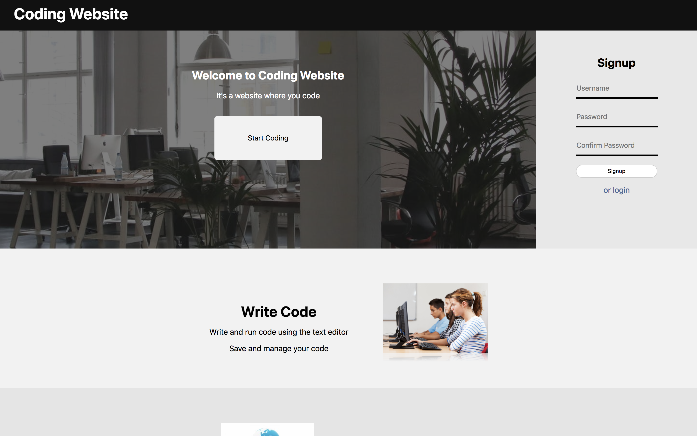
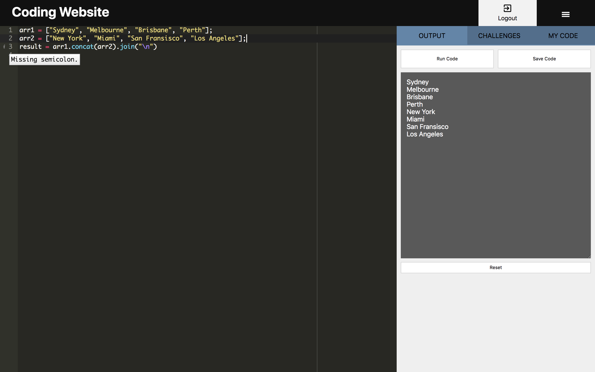
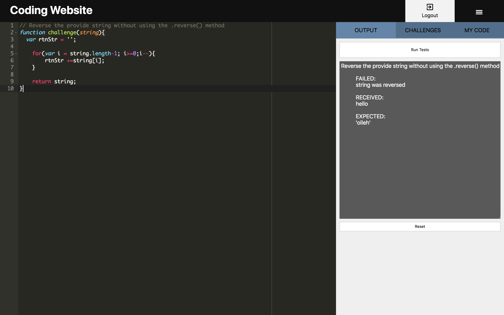

# Coding Website
Coding Website is an web application that allows users to create, evaluate and take code challenges in sandboxed environment using Javascript ES5
[Click here to view the backend of Coding Website](https://github.com/MarvinClerge/Coding-Website-Backend)

## Motivation
The goal of this web application was to create a website that would allow users to write, execute, save and take on challenges in Javascript.

## Tech/framework used
#### React.js
Used to create frontend, manage application state, user interface, DOM manipulation, and fetching data from backend API.
#### Ruby on Rails
Used to create backend JSON API.
#### PostgreSQL
Used to store and manage user information.
#### AceEditor
Used for live syntax checking and highlighting of JavaScript code.
#### JS-Interpreter
Used to evaluate JavaScript code in a sandboxed environment

## Installation
In order to use this application ruby and node js must be installed
### MAC OS
1. Download both the frontend and backend of Coding Website
2. Go to the backend folder location in your terminal and run `bundle install`
3. After the installation is complete run `rails db:migrate` and `rails db:seed` to create the database
4. Run `rails s -p 3001` to start the backend rails server
5. Go to the frontend folder location in your terminal
6. Run `npm install` to install required node packages
7. Run `npm start` to start the frontend server
8. Go to http://localhost:3000 in your browser

## How to use?
After installation this application offers a variety of activities. Below are the myriad of things you can do:

#### Login
In top right of the home page is the login section. Here users can create or login to an account.
#### Code
After clicking the “Start Coding” button users can write in the editor on the left.
#### Menu
User can open the side menu by clicking the ≡ button. There are 3 tabs in the menu Output, Challenges and My Code.
#### Output
In the OUTPUT tab of the menu users can run the code, reset the editor, and if logged in save the code.
#### My Code
In the MY CODE tab of the menu if logged in users can view, load and delete their code
#### Challenges
In the CHALLENGES tab of the menu users can take on challenges created by other users. If logged in users can create challenges. When running a challenge the OUTPUT tab will change to only allow running the challenge. Users can switch back to normal by resetting the editor or loading code.

## Screenshots

## License
MIT License

Copyright (c) 2018 Marvin Clerge

Permission is hereby granted, free of charge, to any person obtaining a copy
of this software and associated documentation files (the "Software"), to deal
in the Software without restriction, including without limitation the rights
to use, copy, modify, merge, publish, distribute, sublicense, and/or sell
copies of the Software, and to permit persons to whom the Software is
furnished to do so, subject to the following conditions:

The above copyright notice and this permission notice shall be included in all
copies or substantial portions of the Software.

THE SOFTWARE IS PROVIDED "AS IS", WITHOUT WARRANTY OF ANY KIND, EXPRESS OR
IMPLIED, INCLUDING BUT NOT LIMITED TO THE WARRANTIES OF MERCHANTABILITY,
FITNESS FOR A PARTICULAR PURPOSE AND NONINFRINGEMENT. IN NO EVENT SHALL THE
AUTHORS OR COPYRIGHT HOLDERS BE LIABLE FOR ANY CLAIM, DAMAGES OR OTHER
LIABILITY, WHETHER IN AN ACTION OF CONTRACT, TORT OR OTHERWISE, ARISING FROM,
OUT OF OR IN CONNECTION WITH THE SOFTWARE OR THE USE OR OTHER DEALINGS IN THE
SOFTWARE.
